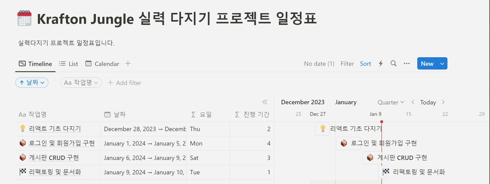

# 개발자를 위한 개발자 커뮤니티 CodeHub

## 1. 목표와 기능

### 1.1 목표

- 개발자를 위한 개발자 커뮤니티 제작 목표

### 1.2 기능

- 게시판 기능 CRUD 제공
- 구글 로그인 기능 제공

### 1.3 사용 기술

- Node.js(프론트엔드)
- Express(백엔드)

## 2. 프로젝트 구조와 개발 일정

### 2.1 프로젝트 구조

📦src/
┣ 📂components/
┃ ┣ 📂common/ # 재사용 가능한 공통 컴포넌트
┃ ┃ ┣ 📂Header/
┃ ┃ ┃ ┣ 📜Header.jsx
┃ ┃ ┃ ┗ 📜Header.css
┃ ┃ ┗ 📂ModalComponent/
┃ ┃ ┣ 📜ModalComponent.jsx
┃ ┃ ┗ 📜ModalComponent.css
┃ ┣ 📂boards/ # 게시판 관련 컴포넌트
┃ ┃ ┣ 📂Create/
┃ ┃ ┃ ┣ 📜FreePostCreate.jsx
┃ ┃ ┃ ┗ 📜FreePostCreate.css
┃ ┃ ┣ 📂Detail/
┃ ┃ ┃ ┣ 📜FreePostDetail.jsx
┃ ┃ ┃ ┗ 📜FreePostDetail.css
┃ ┃ ┣ 📂Edit/
┃ ┃ ┃ ┣ 📜FreePostEdit.jsx
┃ ┃ ┗ 📂List/
┃ ┃ ┣ 📜FreePostList.jsx
┃ ┃ ┗ 📜FreePostList.css
┃ ┣ 📂landing/ # 로그인, 가입 등 초기 페이지 관련 컴포넌트
┃ ┃ ┣ 📂LandingPage/
┃ ┃ ┃ ┣ 📜LandingPage.jsx
┃ ┃ ┃ ┗ 📜LandingPage.css
┃ ┃ ┣ 📂Login/
┃ ┃ ┃ ┣ 📜Login.jsx
┃ ┃ ┃ ┗ 📜Login.css
┃ ┃ ┗ 📂SignUp/
┃ ┃ ┣ 📜SignUp.jsx
┃ ┃ ┗ 📜SignUp.css
┃ ┗ 📂profile/ # 프로필 관련 컴포넌트
┃ ┣ 📂Profile/
┃ ┃ ┣ 📜Profile.jsx
┃ ┃ ┗ 📜Profile.css
┃ ┣ 📂Logout/
┃ ┃ ┣ 📜Logout.jsx
┃ ┃ ┗ 📜Logout.css
┃ ┗ 📂Write/
┃ ┣ 📜Write.jsx
┃ ┗ 📜Write.css
┣ 📂assets/ # 이미지, 비디오 등의 리소스 파일
┃ ┣ 📜banner1.png
┃ ┣ 📜comment.png
┃ ┣ 📜like.png
┃ ┣ 📜search.gif
┃ ┣ 📜search.png
┃ ┣ 📜view.png
┃ ┣ 📜write.png
┃ ┣ 📜background.mp4
┃ ┣ 📜Login.png
┃ ┗ 📜Login3.png
┣ 📂hooks/ # 커스텀 훅
┃ ┣ 📜firework.js
┃ ┗ 📜useTypingEffect.js
┣ 📂services/ # 서버와의 통신을 담당하는 파일
┃ ┣ 📜API.js
┃ ┣ 📜Board.js
┃ ┣ 📜Comment.js
┃ ┣ 📜DataBase.js
┃ ┣ 📜LoginBack.js
┃ ┗ 📜Server.js
┣ 📜.env
┣ 📜App.js
┣ 📜App.css
┣ 📜index.js
┣ 📜index.css
┣ 📜Logo.png
┣ 📜README.md
┗ 📜reportWebVitals.js

### 2.2 개발 일정

## 3. 데이터베이스 모델링(ERD)

### `users` table

| Field        | Type         | Null | Key | Default | Extra          |
| ------------ | ------------ | ---- | --- | ------- | -------------- |
| id           | int          | NO   | PRI |         | auto_increment |
| username     | varchar(255) | YES  |     |         |                |
| password     | varchar(255) | YES  |     |         |                |
| email        | varchar(255) | YES  |     |         |                |
| nickname     | varchar(255) | YES  |     |         |                |
| picture      | varchar(255) | YES  |     |         |                |
| picturestore | varchar(255) | YES  |     |         |                |

### `posts` table

| Field      | Type         | Null | Key | Default           | Extra                                         |
| ---------- | ------------ | ---- | --- | ----------------- | --------------------------------------------- |
| id         | int          | NO   | PRI |                   | auto_increment                                |
| title      | varchar(255) | NO   |     |                   |                                               |
| author     | varchar(255) | NO   |     |                   |                                               |
| content    | text         | NO   |     |                   |                                               |
| created_at | timestamp    | YES  |     | CURRENT_TIMESTAMP | DEFAULT_GENERATED                             |
| updated_at | timestamp    | YES  |     | CURRENT_TIMESTAMP | DEFAULT_GENERATED on update CURRENT_TIMESTAMP |
| views      | int          | YES  |     | 0                 |                                               |
| likes      | int          | YES  |     | 0                 |                                               |
| comments   | int          | YES  |     | 0                 |                                               |
| user_id    | int          | YES  | MUL |                   |                                               |

#### Relationships

- `posts` table is related to `users` table through `user_id` field.

### `likes` table

| Field   | Type | Null | Key | Default | Extra          |
| ------- | ---- | ---- | --- | ------- | -------------- |
| id      | int  | NO   | PRI |         | auto_increment |
| user_id | int  | YES  | MUL |         |                |
| post_id | int  | YES  | MUL |         |                |

#### Relationships

- `likes` table is related to `users` table through `user_id` field.
- `likes` table is also related to `posts` table through `post_id` field.

### `comments` table

| Field      | Type         | Null | Key | Default           | Extra                                         |
| ---------- | ------------ | ---- | --- | ----------------- | --------------------------------------------- |
| id         | int          | NO   | PRI |                   | auto_increment                                |
| post_id    | int          | YES  | MUL |                   |                                               |
| content    | text         | NO   |     |                   |                                               |
| author     | varchar(255) | YES  |     |                   |                                               |
| created_at | timestamp    | YES  |     | CURRENT_TIMESTAMP | DEFAULT_GENERATED                             |
| updated_at | timestamp    | YES  |     | CURRENT_TIMESTAMP | DEFAULT_GENERATED on update CURRENT_TIMESTAMP |

#### Relationships

- `comments` table is related to `posts` table through `post_id` field.

## 4. 트러블 슈팅

- 기능에 대한 고민

  1. 로그인 및 회원가입에서 유저에게 요구하는 정보의 양

  - 최근 만들어진 사이트일수록 이메일 및 비밀번호만 요구하는 곳이 많음
    개인정보에 대한 안전함을 위해 적은 정보를 요구하는 것도 좋은 방법

  2. `추천 취소`에 대한 고민

  - 트랜잭션이 2번 발생하고 이것을 실시간으로 받을 필요 있는 정보인지에 대한 고민
  - 다른 곳들은 [batch processing]을 사용하여 정보를 받는다고 함 정보를 한번에 받아서 진행
  - 다른 정보들도 `추천 취소` 처럼 고민할만한 여지가 있다는 것을 느낌

- 구글 로그인 문제

  - 로그인 하면서 회원가입 기능을 진행했으나, 후에 분리하면서 문제 발생
  - 상세하게 디버깅하면서 문제 해결
    - 토큰이 서버에서 생성됐는가?
    - 구글에서의 토큰을 클라이언트에서 디코딩 했는가?
    - 해당 토큰이 안전하게 서버로 이동했는가?
    - 서버에서 이동한 토큰은 디코딩을 성공했는가?

- 사진 업로드 문제

  - 구글 로그인을 구현하면서 '사용자 사진'을 받아올 수 있는 점에서
    DB에 계획에 없던 사진 업로드 기능을 추가
  - 기존 구글 업로드 사진은 'http 형식' 이지만
    amazon cloud같은 스토리지 서비스를 사용하지 않으므로 로컬에 파일이 저장됨
  - 해당 파일을 파싱을 통해 http 형식으로 변환
    - 해당 과정에서 사용자에 대한 토큰을 달리 줘보는 등 다양한 시도 있었음

- React식 문법과 협업을 위한 고민
  - 코드를 마무리할 때 즈음, React라이브러리를 충분히 포텐셜 있게 활용했는가 라는 고민과 문서 배치가 매우 개인적이다 라는 고민을 함
  - 협업에 대비한 리팩토링 기간을 따로 두면서 비효율적으로 배치됐던 코드들을 최대한 정돈해서 배치
  - 그 과정에서 '기능(js)'과 '실행(jsx)' 파일로 분리하려고 했으나 실패
    - 해당 부분은 권장하지 않는다고 확인함
